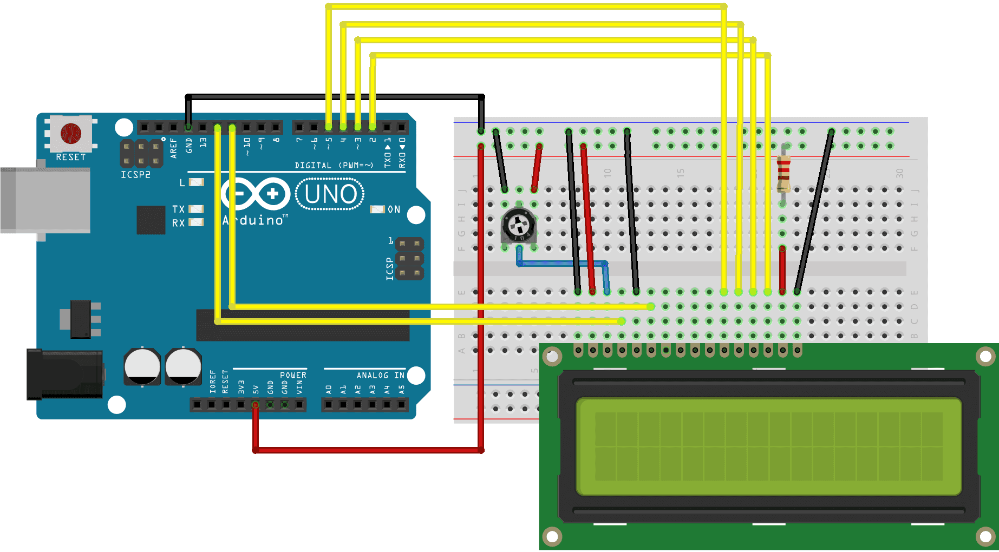

# LCD Display with Arduino Uno

## Components
* Arduino Uno Board \[x1\]
* Breadboard \[x1\]
* 10k ohm Potentiometer \[x1\]
* 200 ohm Resistor \[x1\]
* Male-to-Male Jumper Wire \[x15\]

## Configuration Diagram

## Common Issues
* Check potentiometer terminal connections and adjust wiper
  * VCC/Power should be connected to +5V
  * Output/Signal should be connected to LCD VO pin (pin3)
  * Ground should be connected to GND

## Resources
* [Liquid Crystal Displays (LCD) with Arduino](https://docs.arduino.cc/learn/electronics/lcd-displays)