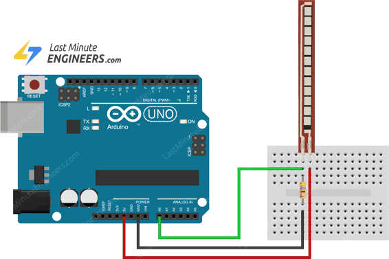

# Flex Sensor with Arduino Uno

## Components
* Arduino Uno Board \[x1\]
* Breadboard \[x1\]
* Flex Sensor (2 in, 30k (straight) to 100k (bent) ohm) \[x1\]
* 100k ohm Resistor \[x1\]
* Male-to-Male Jumper Wire \[x5\]

## Configuration Diagram

## Common Issues
* Depending on the flex sensor's resistance, we will need a resistor with the sensor's maximum possible resistance for the voltage divider circuit.
  * To get the flat resistance, use a multimeter on the unbent flex sensor.
  * To get the bend resistance, use a multimeter on the flex sensor after bending it 90 degrees.

## Resources
* [Interfacing Flex Sensor with Arduino](https://lastminuteengineers.com/flex-sensor-arduino-tutorial/)