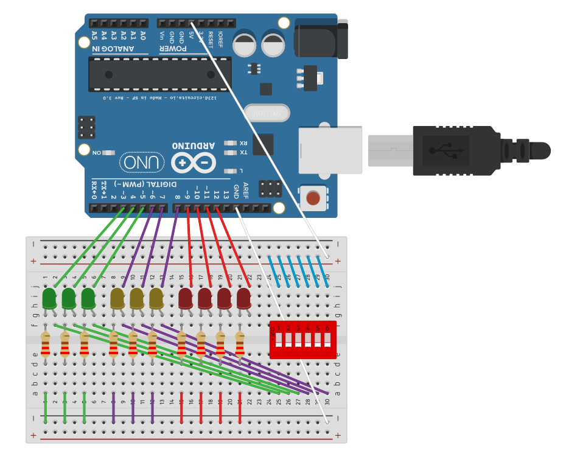

# Testing Arduino Uno Board with LEDs

## Components
* Arduino Uno Board \[x1\]
* Breadboard \[x1\]
* 6-Position Dual In-Line Package (DIP) Switch \[x1\]
* 5mm LEDs \[x10\]
* 200 ohm Resistors \[x10\]
* Male-to-Male Jumper Wire \[x35\]

## Configuration Diagram

## Common Issues
* Check direction of LEDs if not lighting up